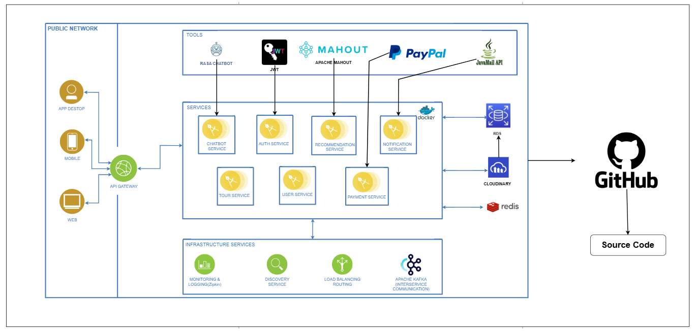
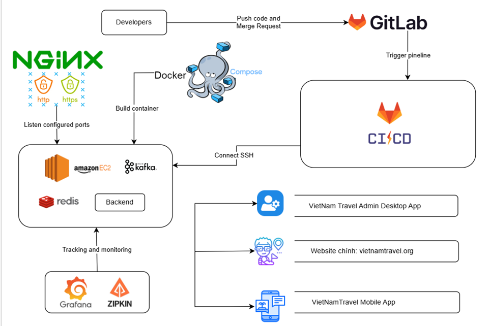

# Project_Booking_Tour_BE
## 1. Tiêu đề và Mô tả Dự án
- Tên Dự án: Đặt Tour Du Lịch Online (Travel VietNam)
- Mô tả Ngắn Gọn:  
Đây là hệ thống đặt tour du lịch trực tuyến, cho phép người dùng tìm kiếm, đặt tour, thanh toán trực tuyến qua PayPal, hỗ trợ chatbot 24/7, xác nhận qua email và quản lý trạng thái booking. Ngoài ra hệ thống còn tối ưu hóa trải nghiệm người dùng bằng việc đề xuất các tour theo lịch sử các tương tác và các yêu cầu lọc. Hệ thống áp dụng kiến trúc microservices với Spring WebFlux, Kafka, và Redis để xử lý các tác vụ thời gian thực.  
## 2. Các Tính Năng Chính
### Dành cho Khách hàng:  
- Tìm kiếm tour du lịch theo điểm đến, ngày khởi hành, giá, số ngày, vùng miền, loại tour, tên ...
- Đặt tour và thanh toán qua PayPal với các trạng thái cập nhật thời gian thực.
- Nhận email xác nhận với OTP, kèm link xác thực booking.
- Quản lí tour yêu thích (Thêm, xóa)
- Quản lí danh mục tour đã đặt (Xem chi tiết, hủy booking, thanh toán)
### Dành cho Quản trị viên (Admin):
- Quản lý danh sách tour, bao gồm thêm, sửa, xóa thông tin tour.
- Theo dõi và xử lý các booking chưa xác nhận hoặc bị hủy.
- Thống kê
### Hệ thống:
- Đề xuất tour du lịch phù hợp
- Hỗ trợ chatbot 24/7
- Gửi email để xác minh tài khoản, đặt tour.
- Lưu trữ trạng thái booking trong Redis (TTL 24 giờ).
- Cập nhật trạng thái booking qua email và PayPal webhook.
## 3. Kiến trúc Hệ thống
Kiến trúc: Microservices  
Các service chính:  
- AuthService: Xác thực người dùng, cấp JWT, xác minh qua email.
- UserService: Quản lý thông tin người dùng (khách hàng và admin).
- TourService: Quản lý danh sách tour và thông tin liên quan.
- PaymentService: Xử lý thanh toán qua PayPal và cập nhật trạng thái booking.
- NotificationService: Gửi email thông báo và xác thực booking.
- ChatbotService: Hỗ trợ chatbot.
### Sơ đồ kiến trúc:

### Sơ đồ triển khai:

## 4. Công Nghệ Sử Dụng
Backend:  
- Spring WebFlux, Spring Security, R2DBC, Liquibase
- Kafka (Reactor Kafka)
- Redis (caching và TTL cho OTP)
- Docker
- Rasa 
- Apache Mahout

Frontend: ReactJS(web), React Native (mobile), ElectronJs (Desktop)  
Cơ sở dữ liệu: MariaDB (hỗ trợ reactive với R2DBC)  
Công cụ CI/CD: Docker, GitHub Actions  
Thanh toán: PayPal API
## 5. Kết Quả và Demo
- Video Demo: https://youtu.be/dqNxAGXFTj0
## 6. KẾT QUẢ 
### 6.1. Kết quả đạt được
Trong nghiên cứu này, chúng tôi đã giới thiệu Travel Vietnam, một ứng dụng đặt tour du lịch thông minh, tích hợp hệ thống gợi ý dựa trên hành vi người dùng. Ứng dụng đã thành công trong việc kết hợp các công nghệ hiện đại như học máy, phân tích dữ liệu và kiến trúc microservices để tạo ra một sản phẩm đáp ứng nhu cầu cá nhân hóa ngày càng cao của người dùng.
Các điểm nổi bật của nghiên cứu:
-	Hệ thống gợi ý hiệu quả: Việc kết hợp Content-Based Filtering và Collaborative Filtering đã giúp hệ thống đưa ra những gợi ý chính xác và phù hợp với sở thích của từng người dùng.
-	Kiến trúc linh hoạt: Việc sử dụng kiến trúc microservices và các công nghệ hiện đại như Java, React, Docker đã giúp hệ thống có khả năng mở rộng và dễ dàng bảo trì.
-	Giao diện người dùng thân thiện: Ứng dụng cung cấp giao diện trực quan, dễ sử dụng, giúp người dùng dễ dàng tìm kiếm và đặt tour.
-	Tính cá nhân hóa cao: Hệ thống gợi ý thông minh giúp người dùng khám phá những tour du lịch phù hợp với sở thích và nhu cầu cá nhân.
-	Nâng cao trải nghiệm người dùng: Ứng dụng giúp người dùng tiết kiệm thời gian tìm kiếm và dễ dàng tìm thấy những tour du lịch phù hợp.
### 6.2. HẠN CHẾ CỦA ĐỒ ÁN
-   Chưa xử lý hoàn thiện các chức năng của admin
-	Thuật toán gợi ý chưa xử lý được với các mô hình phức tạp.
-	Chưa đa dạng về phương thức thanh toán.
-	Dữ liệu tour còn hạn chế
-	Chatbot AI chưa linh hoạt
### 6.3. HƯỚNG PHÁT TRIỂN 
Mặc dù đã đạt được những kết quả khả quan, ứng dụng Travel Vietnam vẫn còn nhiều tiềm năng để phát triển:
-   Hoàn thiện các chức năng cho Admin.
-	Hoàn thiện thuật toán gợi ý: Tiếp tục cải thiện độ chính xác của thuật toán gợi ý bằng cách sử dụng các kỹ thuật học sâu, như mạng neural, để xây dựng các mô hình phức tạp hơn.
-	Tích hợp thêm các yếu tố ngữ cảnh: Xét đến các yếu tố ngữ cảnh như thời tiết, sự kiện đặc biệt, để đưa ra các gợi ý phù hợp hơn.
-	Mở rộng cơ sở dữ liệu tour: Tích hợp thêm nhiều loại hình tour, điểm đến và đối tác du lịch để đa dạng hóa lựa chọn cho người dùng.
-	Phát triển các tính năng xã hội: Cho phép người dùng chia sẻ kinh nghiệm du lịch, đánh giá tour, và tương tác với nhau.
-	Tích hợp thanh toán đa dạng: Hỗ trợ nhiều hình thức thanh toán khác nhau để đáp ứng nhu cầu của người dùng.
-	Triển khai trên nhiều nền tảng: Mở rộng ứng dụng lên các nền tảng khác như smartwatch, thiết bị đeo để tạo ra trải nghiệm liền mạch cho người dùng.
-	Đánh giá và cải tiến liên tục: Thu thập phản hồi từ người dùng để cải thiện chất lượng của ứng dụng và nâng cao trải nghiệm người dùng.
 

